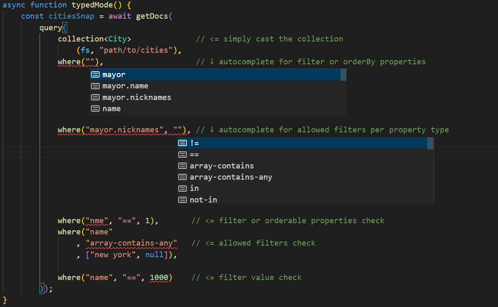

# StrongStore 
(formerly *firestore-typed*)

&nbsp;
## What it is?

StrongStore is a type wrapper for [firebase 9 web sdk]([/guides/content/editing-an-existing-page](https://www.npmjs.com/package/firebase)), specifically targeting the firestore module redeclaring the necessary functions in order to provide a typed 
firestore. 

It allows for autocomplete and type checking based on a simple configuration.

&nbsp;
## Installation Guide
______________
&nbsp;
- Install the firebase package dependency:
    ```
    $ npm install firebase@9
    ```
- Install the strongstore package:
    ```
    $ npm install -D strongstore
    ```

&nbsp;
## Configuration
__________
&nbsp;

StrongStore redeclares functions in 'firebase/firestore' so if you have --skipLibCheck false it will throw a redeclaration error for each of one of those functions. 

&nbsp;
- Import it into a declaration (d.ts) file:
    ```ts
    import "strongstore";
    ```

&nbsp;
### Modes
&nbsp;

StrongStore works in two mutually exclusive ways: Strict or Typed.

&nbsp;
#### Typed Mode
&nbsp;
- Simply use firebase as you'd normally do:
    ```ts
    import { collection, getDocs, getFirestore, orderBy, query, where } from 'firebase/firestore';
    ```
- Import your document models:
    ```ts
    /* 
        interface City { name:string; mayor: Person; } 
        interface Person { name:string; nicknames: string[]; } <- a nested object
    */
    
    import { City } from './models/city';
    ```
- Enjoy the range the features provided: 
    
    
- Declare you firestore paths 
    ```ts
    declare global {
        type FirestorePaths = {
            cities: City;
            ["cities/cityCenters"]: CityCenter; // <- to express a sub collection
        }
    }
    ```
## Usage

    
- But now you'll enjoy based solely on the collection path:
  - Autocomplete for paths:
    
    

  - Autocomplete filters for property type:
  
    

  - Checks for the above:
    
    
    
    
  
  - Type checking for property values
    
    


